# Sprawozdanie `s.1`

| ID związane z tą sprawą | Typ ID     | Nazwa właściwa   | Powiązanie                 |
| ----------------------- | ---------- | ---------------- | -------------------------- |
| `519903611120123924`    | Użytkownik | Senpai           | Oskarżony                  |
| `782299960283627540`    | Bot        | Shiroe           | Bot oskarżonego            |
| `1097953521392959529`   | Użytkownik | Joker            | Możliwy "wtyk" oskarżonego |
| `745313882196934690`    | Użytkownik | Sara             | Zarząd bota Shiroe         |
| `848854268819275776`    | Użytkownik | "Shiroe Support" | Zarząd bota Shiroe         |

Przygotowane przez **patYczakus**. Utworzono: `10.07.2025`, ostatnio edytowano: `23.07.2025`

---

Przez całe życie zastanawiałem się, czy da się upaść naprawdę nisko na Discordzie. I jak widać, znam odpowiedź: Tak, na przykład Senpai - osoba samolubna, bezduszna, pilnująca tylko własnego nosa.

Niby z początku osoba jak każda inna, chętna do pomocy, ale później ujawnia swoje prawdziwe "ja". Tutaj podane będą całe powody, rozpoczynając od najmniejszych przewiń, do tych najcięższych.

## 1. Zachowanie

Zaczniemy od małego przewinienia, który może i nie za bardzo wnosi tak dużo, ale zawsze pod to można podłapać małe poziomy.

Oczywistość nad oczywistością - **masowe usuwanie swoich wiadomości**. Dlaczego? "Dla bezpieczeństwa" - właśnie widać. Niby dlatego, że miał złą sytuację, i zaczął usuwać. Na domysłach myślę, że przez to, że poprzednie konto zostało zbanowane - to jednak nie potwierdzone. Ja bym jeszcze zrozumiał to, ale mówi się, że w internecie nic nie ginie, więc czy te starania mają jakiś sens? I tak z tego tytułu zostały nałożone bany.

> 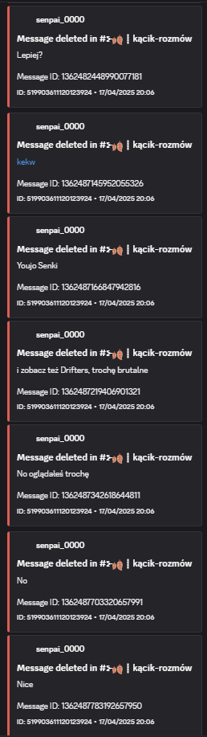
>
> _Logi usuniętych wiadomości_

Druga sprawa - **atencja**. Może ja przesadzam, nie wiem, ale jeśli ktoś się przez niego ani razu nie wkurzył, czy się nie zażenował, niech pierwszy rzuci kamieniem. "Wolę w swoim [świecie żyć] niż w waszym" - gdyby tylko miało realne połączenie z rzeczywistością, bo tego właśnie brakuje.

> 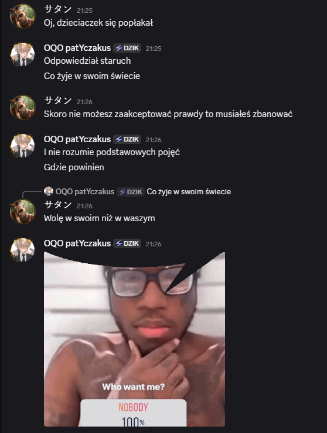
>
> _Fragment konwersacji Senpai-patYczakus (nawiązanie do cytatu)_

"Skoro nie możesz zaakceptować prawdy to musiałeś zbanować." Tyle że to prawda stała po mojej stronie (więcej o tym mówię w punkcie trzecim), bo to był fakt.

## 2. Bezpodstawne bany

Dobra, może słowo "bezpodstawne" nie pasuje aż tak dobrze tutaj, ale wciąż bany są śmieszne, jak i żałosne. To nie jest typowy taryfikator, to jest księga prawdziwego komunisty. Nie zgadzasz się z jego ideą? Proszę bardzo: ban z 12 punktami. "Daj mi człowieka, a znajdę na niego paragraf" chyba wszedł zbyt za mocno.

Pierwszy powód dlaczego Senpai ma duże szanse stać się dyktatorem państwa i dlaczego ban Shiroe jest wykreowany:

> 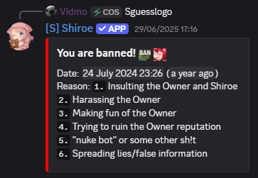
>
> _Ban #1 - "Że Shiroe spyware? To prawda, więc nadeszła idealna okazja na bana!"_

Tutaj ważny jest kontekst. Od użytkownika się dowiedziałem, że po prostu nazwał jego bota spywarem, gdyż "troche podejrzane, że właściciel [Senpai] wie, co o nim piszesz i jego bocie, i nagle wbija po kilku minutach na serwer". Coś jest nie tak...

Kolejny ban do kolekcji, czyli jak zostać skorojonym o 25 zł:

> 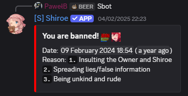 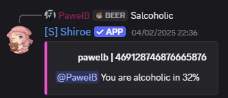 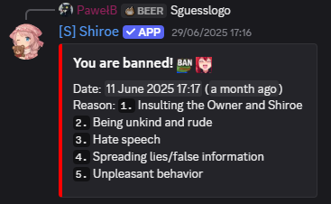
>
> _Ban #2 - Senpai kiedy transakcja odrzucona_

Da się zjechać jeszcze niżej? Tak, się da:

> 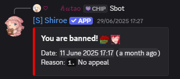
>
> _Ban #3 - Powód: "bo tak, nieodwoływalny i ch-"_

Aby nie było, sam narobiłem z 8 punktów, niektóre mają ziarenko prawdy, ale niektóre rzeczywiście są wyssane z palca. Ciekawe ile dodatkowo zbiorę punktów za udostępnienie tego sprawozdania... naprawdę ciekawe...

> 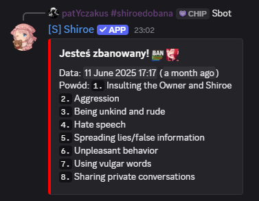
>
> _Ban #4 - Zawsze do usług_

Co do banów #2, #3 oraz #4 nadejdzie pora.

I jeszcze sytuacja z banem Senpaia... mówiłem o tym, że zdobył już bany za usuwanie wiadomości - to wszystko spowodowane przez Juliseq. Ona zbanowała go, to ten się spłakał i zbanował w swoim bocie. Podobna sytuacja była, jak zbanował ją na mysterY (gdzie nie powinien był tego robić) po ponownym banowaniu za to samo.

_To kiedy rekord Guinessa za ilość niesłusznych banów? XD_

### Lekka aktualizacja - 23.07.2025

W końcu się dowiedziałem, że update został zrobiony banów. Obecnie teraz zamiast pojedynczego powodu Hutao ma 6 punktów:

> 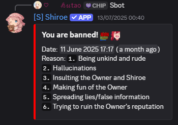
>
> _Zakutalizowany ban #3_

Ja sam zaś zarobiłem z kolejne 4:

> 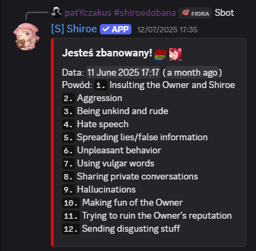
>
> _Zaktualizowany ban #4 - niby rekord_

Czy "halucynacje" serio są powodem, gdyż _niby_ mówiłem nieprawdziwe informacje? Są logi, są świadkowie, a Ty dalej twierdzisz, drogi Senpaiu, że jesteś niewinny? Oczywiście pomijam fakt, że idąc tym tokiem dajesz dwa razy ten sam powód...

## 3. "Wtyki" kanału

> 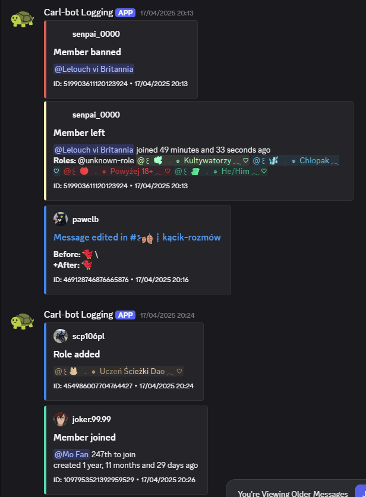
>
> Logi bana Senpaia i dołączenia Jokera

Tak, wersja ze szpiegowaniem jest możliwa. Dlaczego? Bo nie tylko przez bota, ale przez swoje konta. Takim przykładem jest Joker - "wtyk" Senpaia, ale bym się nie ździwił, jakby to był jego multik.

Po raz pierwszy został wykryty na serwerze Ptaszunio, gdzie to Senpai dostał degrada z decyzji Hutao. Później jednak po wspólnych serwerach pojawił się na serwerze, gdzie dostał kolejnego bana (gdzie wspominałem o tym).

Znaczy, wykryty - wykryty wykrytym, gdyby nie wyszedł ze serwera i wysłał zrzut ekranu.

> 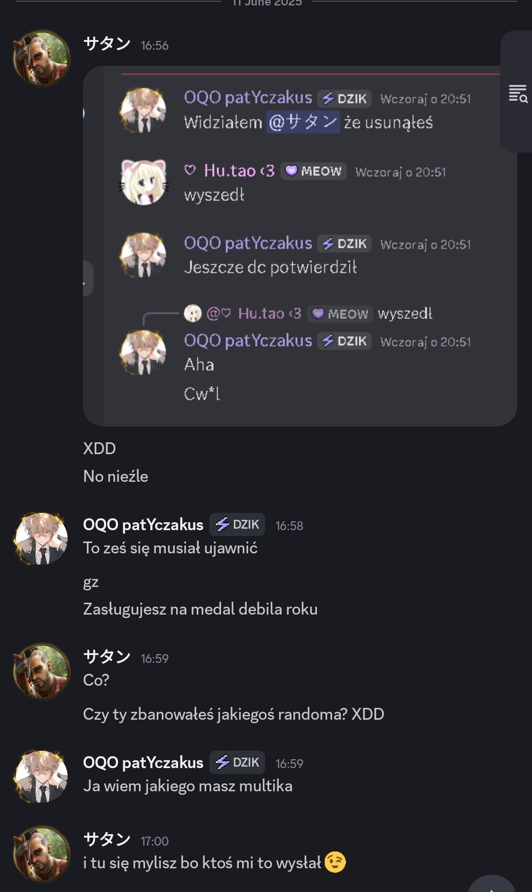
>
> _Fragment konwersacji Senpai-patYczakus_

Skąd wiadomo, że to on? A po podobieństwach właśnie: konto ma ten sam schemat co Sara oraz "Shiroe Support"

> 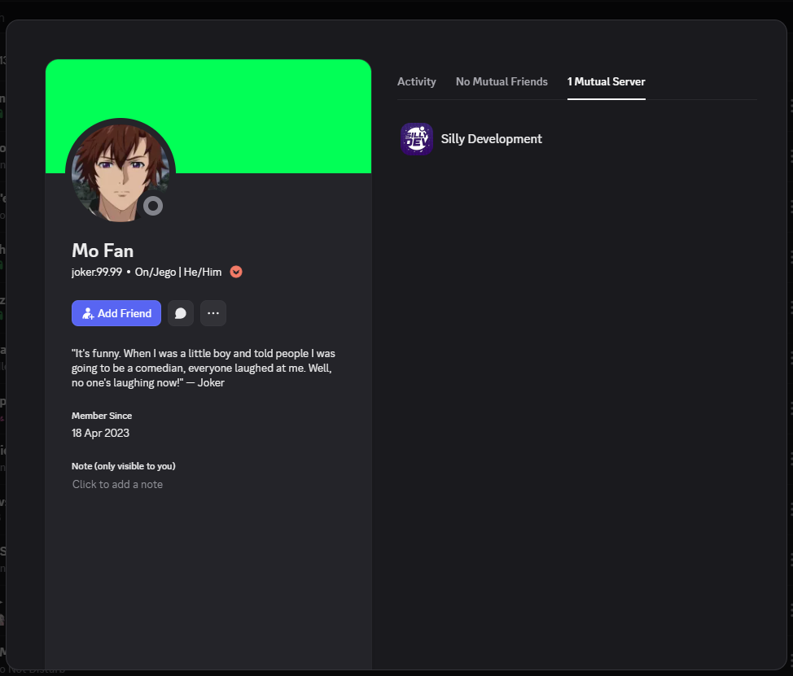
>
> _Konto Jokera_

> 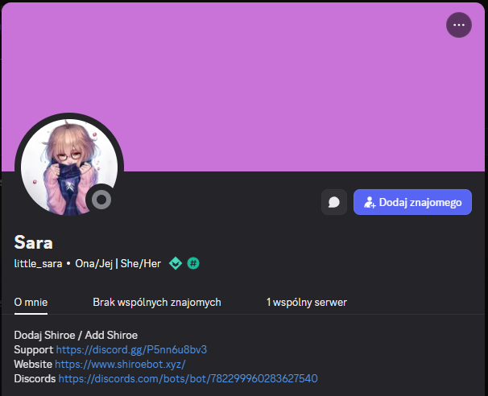
>
> _Konto Sary_

> 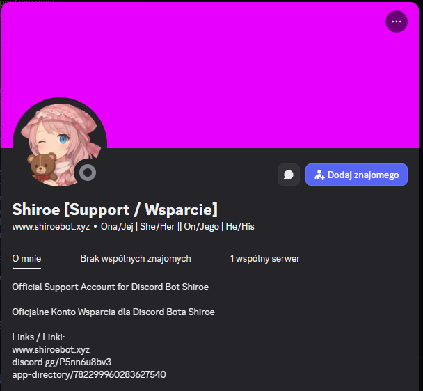
>
> _Konto "Shiroe Support"_

Gdyby ktoś nie był przekonany, może to przekona: styl wypowiedzi. Z tego, co można było się dowiedzieć, widać podobieństwo w wypowiedzi - tak, specjalnie się zalogował na discordzika, aby napisać negatywny komentarz na Ptaszuniu.

> Niestety, zgubiłem dowód tego - jeżeli uda mi się jednak odkopać, wrzucę tutaj.

## 4. Rajd z udziałem bota osoby trzeciej

Tak. Wykorzystał bota Globally z ilością 80+ serwerów, aby zrajdować te serwery, które można. Sporo oberwało, te jednak, które mogły, ochroniły się.

Nie potrafił się przyznać do swojego multika, a po banie pewnie tak nie darował sobie, że napisał skrypt niszczący serwery. Pomijając fakt, że już status miał wyłączony, gdzie cały czas wyświetla swój status oraz aktywność.

"Ale zaraz zaraz, czemu akurat on?" ktoś może zapytać. Jako jedyny - poza mną - miał dostęp do tokenu bota. Świadkami mogą być chociażby PawełB oraz Hutao. Nie, wciąż nie usuwałem tego. Plus to, czy miał wgl ten plik, ciężko stwierdzić.

> 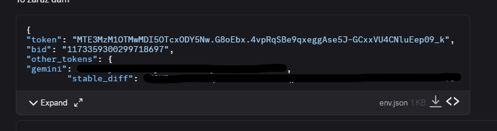
>
> _Fragment konwersacji Senpai-patYczakus (token już **nieaktywny**)_

Czemu posiadał token? Gdyż zaoferował mi nowy hosting, a to, że stary był, jaki był, zgodziłem się. Potem jednak przez problemy z limitami wróciłem na starego.

Tutaj popełniłem błąd - mogłem zapobiec tej tragedii. Lecz totalnie zapomniałem zmienić. Może bym się podłapał później, ale nie w trakcie wyrzucania. **I nie - żadnej różnicy by nie zrobiło przechowywanie w `.env`.** Tutaj jest historia, czemu musiałem się przenieść na `env.json`, ale to nie na te sprawozdanie.

## Podsumowanie

W taki sposób podsumowałem winę Senpaia. Według Kaberetu Moralnego Niepokoju "z głupotą się nie walczy, głupotę się omija", no ale błagam - udawanie siebie jak jakieś bóstwo świata, przykładowo na wzór Lighta (_Death Note_ nawiązanie), nigdy nie zadziała. Sama historia to pokazała na przykładzie III Rzeszy czy ZSRR.

To nie jest atak personalny, choć by tak mógł wyglądać. Tylko uświadamiam, że jeszcze tacy ludzie jak on mogą istnieć.

**Czy można więc jemu ufać?** Niby można, bo w praktyce grał na otwarte karty, ale radzę na niego uważać. Jego rutyna usuwania wiadomości jest już sama w sobie podejrzana, ale broń Boże nie pójdzie tak jak on chce, to źle może się skończyć.

Z tego sprawozdania wyrok będzie podwójny. Dla Senpaia, jak i jego multika oraz kont związanych z botem, tak zostały ustalone poziomy:

| Kategoria               | Dodany poziom | Na podstawie...                                                           |
| ----------------------- | ------------- | ------------------------------------------------------------------------- |
| acting_against_smth     | 7             | Nadużycie uprawnień, bany za śmieszne powody, opłaty, rajdowanie serwerów |
| harassment_or_bullying  | 5             | Szykanowanie, personalne ataki                                            |
| scam                    | 5             | Opłaty za odbanowanie, oszustwo                                           |
| misinformation          | 4             | Wprowadzanie w błąd, "halucynacje"                                        |
| evasion_of_restrictions | 4             | Multikonta, obchodzenie banów                                             |
| theft                   | 3             | Potencjalne przejęcie serwerów przez bota                                 |
| hate_speech             | 2             | Szykanowanie                                                              |

...a dla samego bota tak:

| Kategoria           | Dodany poziom | Na podstawie...                                                                    |
| ------------------- | ------------- | ---------------------------------------------------------------------------------- |
| acting_against_smth | 4             | Automatyczne nadany z powodu najwyższego poziomu, potencjalny _discordowy spyware_ |
